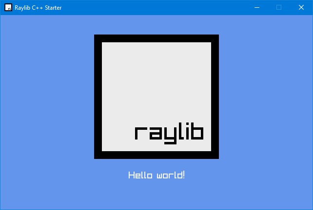

# Raylib C++ Starter



This project was created with **Visual Studio 2022 Community Edition** and should work with it out of the box.

This project requires Raylib installed from **vcpkg**. The installation process is included below.

**Run program:** Ctrl + F5 or Debug > Start Without Debugging menu
**Debug program:** F5 or Debug > Start Debugging menu


## Installing Raylib from vcpkg

1. Open https://github.com/microsoft/vcpkg
2. Clone **vcpkg** in the root `C:` drive or any drive that is convenient to you
3. Open `powershell`
4. Navigate to the **vcpkg** directory from step 2
5. Run `.\bootstrap-vcpkg.bat`
6. Run `.\vcpkg.exe integrate install`
7. Finally, run `.\vcpkg.exe install raylib:x64-windows`

To test if you have Raylib correctly installed, add this line anywhere at the top of `main.cpp`:

```c++
#include "raylib.h"
```


## Tips for Getting Started

1. Use the Solution Explorer window to add/manage files
2. Use the Team Explorer window to connect to source control
3. Use the Output window to see build output and other messages
4. Use the Error List window to view errors
5. Go to Project > Add New Item to create new code files, or Project > Add Existing Item to add existing code files to the project
6. In the future, to open this project again, go to File > Open > Project and select the .sln file


## Copying assets to the build folder

This project has these command lines included under **Project Properties > Build Events > Post-Build Event**

```powershell
md $(OutDir)assets
xcopy /y /d $(ProjectDir)assets $(OutDir)assets
```

You can add more files and folders as needed.
